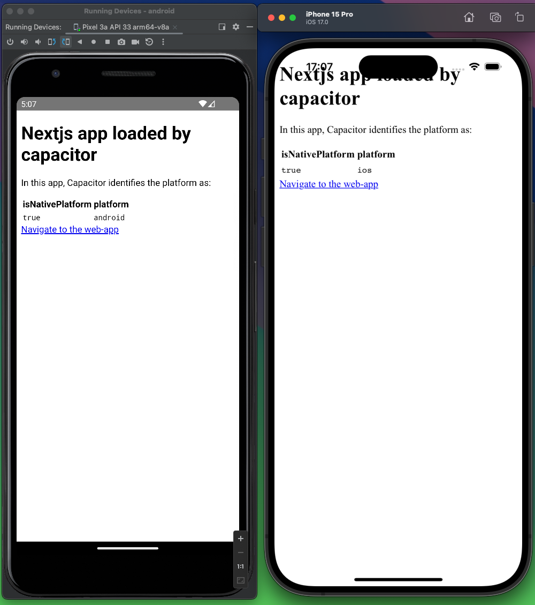
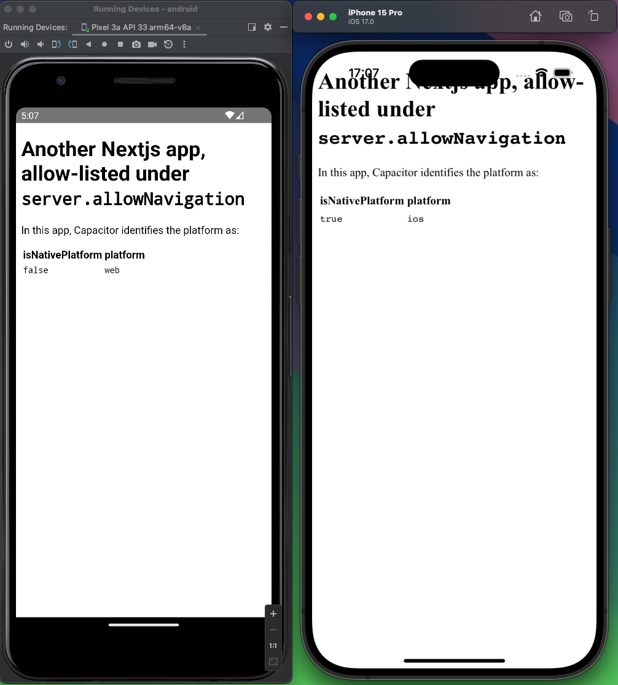

# Capacitor `allowNavigation` issue minimal reproduction

## The project structure

There are two connected apps in this project:

1. A Capacitor app (`./capacitor-app`), that loads a Next.js web app (`./capacitor-app/src/pages/index.tsx`) which renders the capacitor platform and has a link to the second app (`./web-app`).
2. A Next.js web app (`./web-app/src/pages/index.tsx`) which has some Capacitor npm packages like `@capacitor/core` installed, and renders the capacitor platform.

The first app (capacitor-app) has a link to the second app (web-app). The capacitor-app has allow-listed navigation to the web-app by including it in its `server.allowNavigation` config.

## The expected behavior

Both Next.js apps, the one loaded by Capacitor as well as the one inside `server.allowNavigation` should be identified as `"ios"` and `"android"` platforms respectively.

## The current behavior

Both Next.js apps are identified as `"ios"`, when running on a iOS Simulator, but on an Android Simulator, only the first Next.js app (capacitor-app) is identified as the `"android"` platform, while the second one (web-app), the one inside `server.allowNavigation`, is identified as `"web"`.

| capacitor-app                                     | web-app                               |
| ------------------------------------------------- | ------------------------------------- |
|  |  |
